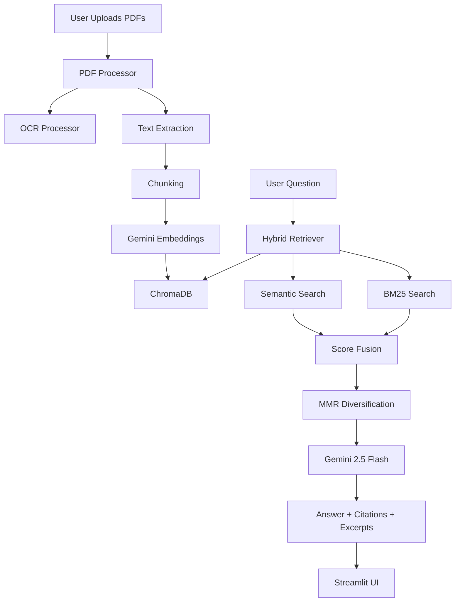

# Fastigo AI PDF Chatbot

A Retrieval-Augmented Generation (RAG) based PDF Question Answering application built with Streamlit, Gemini 2.5 Flash, Gemini Embeddings, ChromaDB, and LangChain.

The application enables users to upload one or more PDF documents and ask natural language questions about their contents. Answers are generated using retrieved document context and include page-level citations and supporting excerpts.

---

# Features

## Core Features

* Upload single or multiple PDF documents
* PDF text extraction using PyMuPDF
* OCR fallback for scanned/image-based PDFs
* Gemini-powered question answering
* Persistent vector storage using ChromaDB
* Session-based conversation memory
* Source attribution with page references
* Supporting excerpts for answer verification
* Streaming responses
* Hybrid retrieval (Semantic Search + BM25)
* MMR-based context diversification

## Bonus Features

* Multi-PDF support
* OCR support
* Docker deployment
* Hybrid search
* Conversation memory
* Streaming responses
* Professional Streamlit UI

---

# Architecture



---

# Design Decisions

## Why Streamlit?

Streamlit provides a fast and efficient way to build interactive AI applications with built-in support for:

* File uploads
* Session management
* Chat interfaces
* Rapid deployment

This allowed rapid development while maintaining a clean user experience.

### Why Gemini 2.5 Flash?

Gemini 2.5 Flash was selected because it offers:

* Low latency inference
* Strong reasoning capabilities
* Cost-effective API usage
* Excellent integration with Gemini embeddings

### Why ChromaDB?

ChromaDB was selected as the vector database because it:

* Provides persistent vector storage
* Integrates seamlessly with LangChain
* Requires minimal infrastructure
* Supports efficient similarity search

### Why Hybrid Retrieval?

Pure vector search may miss exact keywords, while keyword search may miss semantic meaning.

Combining both approaches improves retrieval quality and answer accuracy.

### Why OCR Support?

Many PDFs are scanned documents containing images rather than selectable text.

OCR ensures these documents remain searchable and usable by the chatbot.

### Why Source Attribution?

Every answer includes page-level citations and supporting excerpts.

This improves:

* Transparency
* Explainability
* User trust
* Answer verification

---

# Chunking Strategy

Large Language Models cannot efficiently process entire PDF documents due to context window limitations.

To solve this problem, the application splits extracted document text into smaller chunks before generating embeddings.

The system uses:

```python
RecursiveCharacterTextSplitter(
    chunk_size=1000,
    chunk_overlap=200
)
```

### Why This Configuration?

#### Chunk Size: 1000 Characters

Provides sufficient contextual information while remaining efficient for embedding generation and retrieval.

#### Chunk Overlap: 200 Characters

Preserves context across chunk boundaries and reduces information loss.

### Metadata Stored Per Chunk

Each chunk stores:

* File Name
* Page Number
* Chunk ID
* File Hash

This metadata enables accurate source attribution during question answering.

### Benefits

* Improved retrieval accuracy
* Better contextual continuity
* Reduced information loss
* Reliable page-level citations

---

# Embedding Model Choice

The application uses:

**Gemini Embedding Model**

```text
gemini-embedding-001
```

### Why Gemini Embeddings?

Gemini embeddings provide high-quality semantic representations and integrate naturally with Gemini-based answer generation.

Benefits include:

* Strong semantic understanding
* Consistent embedding space
* Reliable retrieval performance
* Native compatibility with Gemini ecosystem

### Embedding Workflow

1. PDF text is extracted.
2. Text is chunked.
3. Chunks are embedded.
4. Embeddings are stored in ChromaDB.
5. User questions are embedded.
6. Similar chunks are retrieved.

### Storage Strategy

Embeddings are persisted in ChromaDB to:

* Avoid repeated embedding generation
* Improve performance
* Reduce API costs

---

# Retrieval Approach

The application uses a Hybrid Retrieval Architecture.

## Step 1: Semantic Retrieval

User queries are converted into embeddings.

ChromaDB performs vector similarity search to identify semantically relevant document chunks.

Best for:

* Natural language questions
* Conceptual queries
* Paraphrased requests

---

## Step 2: BM25 Keyword Retrieval

BM25 retrieval searches the indexed corpus using keyword matching.

Best for:

* Technical terms
* Product names
* Numerical values
* Exact document references

---

## Step 3: Hybrid Score Fusion

Results from semantic retrieval and BM25 retrieval are combined.

Benefits:

* Higher recall
* Better precision
* More robust retrieval

---

## Step 4: MMR Diversification

Maximum Marginal Relevance (MMR) is applied to:

* Remove redundant chunks
* Improve context diversity
* Increase answer quality

---

## Retrieval Pipeline

```text
PDF Upload
    ↓
Text Extraction
    ↓
Chunking
    ↓
Gemini Embeddings
    ↓
ChromaDB Storage
    ↓
User Query
    ↓
Hybrid Retrieval
(Vector + BM25)
    ↓
MMR Diversification
    ↓
Gemini 2.5 Flash
    ↓
Answer Generation
    ↓
Source Attribution
```

---

# Prompt Design

The application follows a Retrieval-Augmented Generation (RAG) approach.

The language model is instructed to answer only using retrieved document context.

## Prompt Objectives

The prompt is designed to:

1. Prevent hallucinations
2. Restrict responses to document content
3. Provide citations
4. Improve answer trustworthiness
5. Handle missing information gracefully

## Core Rules

The model is instructed to:

* Answer only from retrieved context
* Never fabricate information
* Never use external knowledge
* Always cite source pages
* Always cite source documents
* Include supporting excerpts

## Fallback Response

When relevant information cannot be found:

> I could not find this information in the uploaded documents.

This ensures factual reliability and prevents hallucinated answers.

## Conversation Context

Previous conversation history is included to support:

* Follow-up questions
* Multi-turn conversations
* Better contextual understanding

while remaining grounded in retrieved document content.

---

# OCR Support

OCR is used when a PDF page contains no machine-readable text.

The application:

1. Detects empty pages.
2. Converts pages into images.
3. Uses Tesseract OCR for text extraction.
4. Cleans temporary files.
5. Continues normal indexing.

OCR can be enabled or disabled using:

```env
PDF_OCR_ENABLED=True
```

---

# Environment Variables

| Variable            | Description           |
| ------------------- | --------------------- |
| GOOGLE_API_KEY      | Gemini API Key        |
| GOOGLE_API_PROJECT  | Optional GCP Project  |
| GOOGLE_API_LOCATION | Gemini Region         |
| CHROMA_DB_DIR       | ChromaDB Storage Path |
| MODEL_NAME          | Gemini Model          |
| EMBEDDING_MODEL     | Embedding Model       |
| EMBEDDING_DIMENSION | Embedding Size        |
| PDF_OCR_ENABLED     | Enable OCR            |
| MAX_FILE_SIZE_MB    | Maximum Upload Size   |

---

# Setup Instructions

## Clone Repository

```bash
git clone https://github.com/srujanlakku/fastigo_AI_pdf_chatbot.git

cd fastigo_AI_pdf_chatbot
```

## Create Virtual Environment

```bash
python -m venv .venv
```

### Windows

```bash
.venv\Scripts\activate
```

### Linux / Mac

```bash
source .venv/bin/activate
```

## Install Dependencies

```bash
pip install -r requirements.txt

pip install -r requirements-dev.txt
```

## Configure Environment

Create:

```text
.env
```

Add:

```env
GOOGLE_API_KEY=YOUR_API_KEY
```

---

# Running The Application

```bash
streamlit run app.py
```

Application URL:

```text
http://localhost:8501
```

---

# Docker Deployment

Build:

```bash
docker build -t fastigo-ai-pdf-chatbot .
```

Run:

```bash
docker run -p 8501:8501 ^
-e GOOGLE_API_KEY=YOUR_API_KEY ^
fastigo-ai-pdf-chatbot
```

Docker Compose:

```bash
GOOGLE_API_KEY=YOUR_API_KEY docker compose up --build
```

---

# Testing

Run:

```bash
pytest tests -v
```

Expected Result:

```text
10 Passed
```

---

# Project Structure

```text
app.py

src/
├── chatbot.py
├── chunking.py
├── config.py
├── embeddings.py
├── hybrid_retriever.py
├── logger.py
├── ocr_processor.py
├── pdf_processor.py
├── prompts.py
├── utils.py
└── vector_store.py

tests/
```

---

# Future Improvements

* PDF citation highlighting
* Cross-encoder reranking
* Authentication
* Persistent user workspaces
* Multi-user support
* Cloud vector database integration

---

# Author

Srujan Lakku

GenAI Developer | Agentic AI Engineer

Built as part of the Fastigo Technical Coding Assessment.
