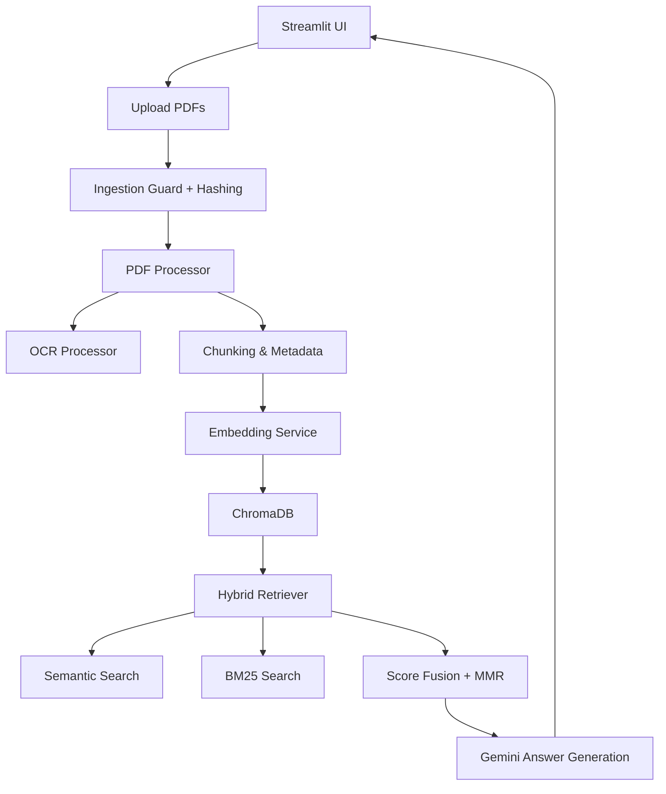

# Fastigo AI PDF Chatbot

A Streamlit RAG application for grounded PDF Q&A using Gemini 2.5 Flash, Gemini embeddings, ChromaDB, and hybrid retrieval.

## Features

- Upload single or multiple PDFs
- OCR fallback for image-only pages (configurable)
- Text extraction with page numbers and metadata
- Chunking with 1,000-character windows and 200-character overlap
- Gemini embeddings stored in persistent ChromaDB
- Hybrid semantic + BM25 retrieval with score fusion and MMR diversification
- Streaming Gemini answers in the UI
- Session-based chat history with follow-up context
- Source citations with filename, page number, and excerpt cards
- Docker-ready deployment with Tesseract OCR support

## Architecture



## Chunking Strategy

- Page-level text is split into overlapping chunks.
- Default window: **1,000 characters**
- Default overlap: **200 characters**
- Splits prefer word boundaries to avoid mid-word cuts.
- Each chunk stores `file_name`, `page_number`, `chunk_id`, and `file_hash`.

## Embedding Strategy

- Model: `gemini-embedding-001` (configurable)
- Output dimensionality: **768** by default via `EMBEDDING_DIMENSION`
- Embeddings are generated during indexing with `embed_texts()`
- Query embeddings use the same model and dimensionality as document embeddings
- ChromaDB stores explicit embedding vectors to avoid dimension mismatch

## Retrieval Strategy

1. **Semantic search** — Gemini query embedding against Chroma vectors
2. **BM25 search** — keyword retrieval over the full indexed corpus
3. **Score fusion** — combines semantic similarity and BM25 with reciprocal-rank contributions
4. **MMR diversification** — reduces redundant chunks in the final context window

## Prompt Design

- System prompt enforces grounded answers only from retrieved context
- Requires citations with filename and page number
- Uses a safe fallback when information is unavailable
- Injects prior conversation history for follow-up questions

## OCR Explanation

- OCR runs only when `PDF_OCR_ENABLED=True`
- Triggered for pages where PyMuPDF text extraction returns empty content
- Uses Tesseract via `pytesseract`
- Temporary image files are deleted after OCR
- Docker image installs `tesseract-ocr` automatically

## Setup

1. Clone the repository
2. Create a Python 3.11+ environment
3. Install dependencies:

```bash
pip install -r requirements.txt
pip install -r requirements-dev.txt
```

4. Copy `.env.example` to `.env` and configure your environment

## Environment Variables

| Variable | Description |
|----------|-------------|
| `GOOGLE_API_KEY` | Required Gemini API key |
| `GOOGLE_API_PROJECT` | Optional GCP project ID |
| `GOOGLE_API_LOCATION` | Gemini region (default `us-central1`) |
| `CHROMA_DB_DIR` | Local ChromaDB path |
| `MODEL_NAME` | Chat model (default `gemini-2.5-flash`) |
| `EMBEDDING_MODEL` | Embedding model (default `gemini-embedding-001`) |
| `EMBEDDING_DIMENSION` | Embedding size (default `768`) |
| `PDF_OCR_ENABLED` | Enable OCR fallback (`True` / `False`) |
| `MAX_FILE_SIZE_MB` | Upload size limit |

## Local Run

```bash
streamlit run app.py
```

## Docker Deployment

Build:

```bash
docker build -t fastigo-ai-pdf-chatbot .
```

Run with persistence and secrets:

```bash
docker run -p 8501:8501 \
  -e GOOGLE_API_KEY=your_api_key \
  -v "%cd%/chromadb:/app/chromadb" \
  fastigo-ai-pdf-chatbot
```

Or with Docker Compose:

```bash
GOOGLE_API_KEY=your_api_key docker compose up --build
```

On Linux/macOS, replace the volume path with `$(pwd)/chromadb`.

## Streamlit Deployment Notes

- The app binds to `0.0.0.0:8501` in Docker
- Set `GOOGLE_API_KEY` in the deployment environment
- Mount `CHROMA_DB_DIR` as a volume to preserve indexed vectors across restarts
- Use **Reset session** in the sidebar to clear chat history and the vector collection

## Troubleshooting

| Issue | Likely Cause | Fix |
|-------|--------------|-----|
| Missing API key error | `GOOGLE_API_KEY` not set | Add it to `.env` or container env |
| OCR returns empty text | Tesseract missing or OCR disabled | Install Tesseract or set `PDF_OCR_ENABLED=True` |
| No relevant content found | PDF not indexed or poor match | Re-upload PDFs and ask a more specific question |
| Embedding dimension error | Old Chroma data from previous version | Click **Reset session** or delete `chromadb/` |
| Slow re-indexing on rerun | Same files already indexed | App skips duplicate indexing automatically |
| Chat generation failed | Gemini quota/network/model issue | Verify API key, model name, and connectivity |

## Testing

```bash
pytest tests/ -v
```

## Project Structure

```text
app.py                  Streamlit UI
src/chatbot.py          Gemini chat + streaming
src/chunking.py         Chunking logic
src/embeddings.py       Gemini embeddings
src/hybrid_retriever.py Hybrid retrieval + MMR
src/ocr_processor.py    OCR fallback
src/pdf_processor.py    PDF text extraction
src/prompts.py          Prompt templates
src/utils.py            Session + upload helpers
src/vector_store.py     ChromaDB integration
tests/                  Unit tests
```

## Future Improvements

- PDF preview with citation highlighting
- Cross-encoder reranking
- Authentication and saved knowledge bases
